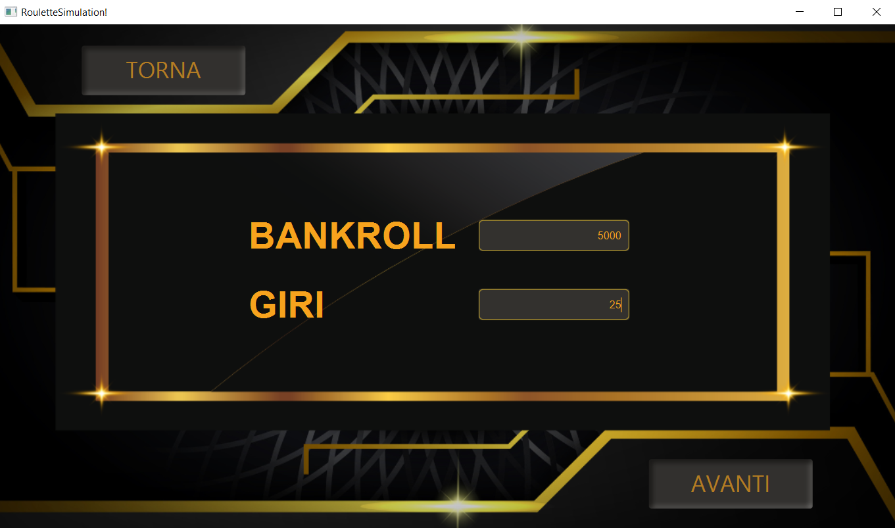
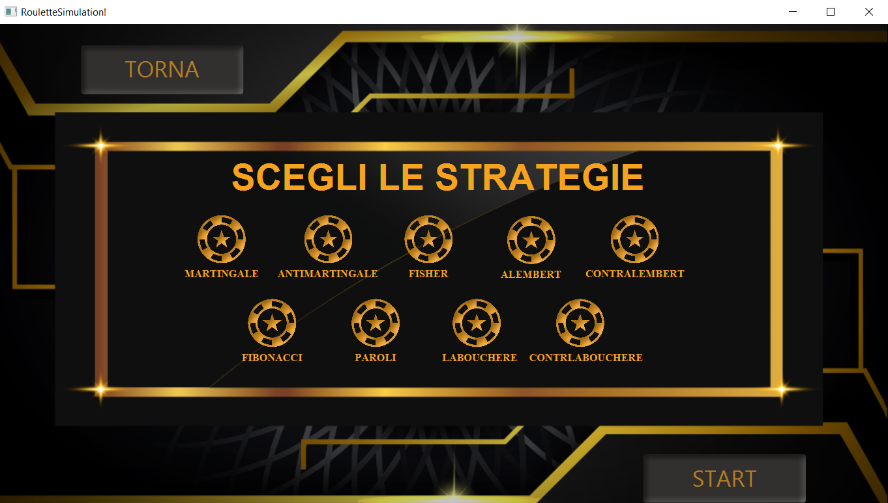
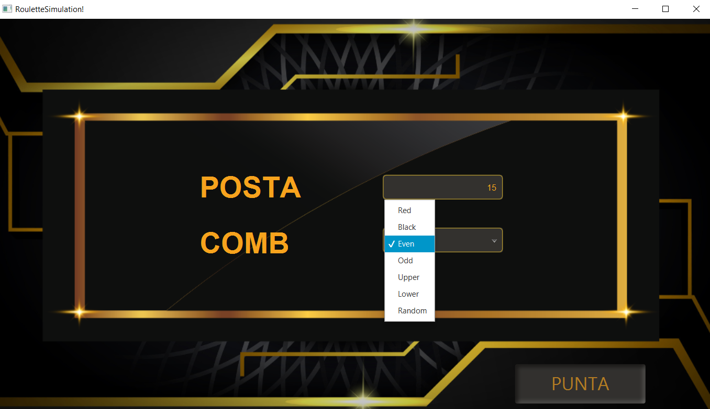
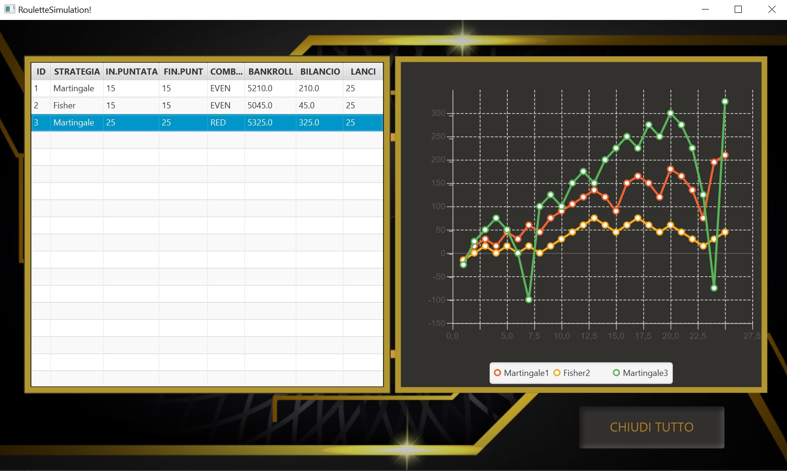

# Roulette Simulation

>«Ma guarda un po'!» si riscaldava la nonna. «Vorrà uscire o no questo zero maledetto? Non voglio più vivere se non lo vedo uscire e starò qui finché non esce! È tutta colpa di quel maledetto croupier riccioluto se non esce mai! Aleksej Ivanoviè, punta due monete d'oro in una volta! Hai già perduto tanto che anche se esce lo zero non vinciamo niente.» ` ` «Ma nonna!»   «Punta, punta! Non son denari tuoi.»
>
>F. Dostoevskij - Il giocatore 

## Introduzione 

Nel gioco d’azzardo perdere è una realtà matematica, e questa non è un’affermazione opinabile: lo dicono i numeri e una certa “formula della convenienza” del calcolo delle probabilità. E il simulatore del gioco della roulette che qui vi presento non fa altro che confermare questa verità, fornendo in aggiunta gli strumenti per osservare e analizzare l’avvenimento durante l’intero corso del gioco. Questo è senza dubbio uno dei principali motivi per i quali è stata progettata questa applicazione.

## Descrizione del gioco

La roulette è un gioco d’azzardo che si svolge intorno ad un tavolo di forma rettangolare, con un piano ricoperto quasi interamente da un tappeto verde sul quale è disegnato il tracciato formato da numeri e combinazioni esterne. La “roulette” è un cilindro in legno il cui interno ruota ed è suddiviso in trentasette caselle, le quali comprendono lo 0, diciotto numeri rossi e diciotto numeri neri alternati tra loro dall’1 al 36. Il gioco è molto semplice: si scommette contro il banco cercando di indovinare in quale numero cadrà la pallina lanciata dal croupier. Esistono varie tipologie di roulette. La più famosa è la roulette francese ed quella su cui il simulatore poggia le basi.

## Obiettivo del progetto

Dal momento che è matematicamente impossibile vincere contro il banco sulla lunga distanza, nel tempo sono state sviluppate strategie che mirano a mantenere il bilancio del giocatore il più alto possibile. Le strategie sono il fulcro di questo progetto: in pratica esse indicano come verranno gestite le puntate ad ogni giro della roulette a fronte di una possibile vincita o perdita. L’obiettivo del simulatore è testare una o più strategie e alla fine ottenere per ciascuna di esse l’andamento complessivo del bilancio del giocatore.

## Funzionamento dell'applicazione

Il simulatore ha la capacità di testare più strategie diverse contemporaneamente. Una strategia non differisce solamente dalla sua tipologia (Martingale, Fisher, Lobouchere, etc.) ma anche dal valore della puntata e/o dalla combinazione scelta. Per avviare la simulazione è necessario inserire un bankroll e il numero di lanci della pallina che verranno effettuati durante il corso del gioco. Questi parametri sono uguali per tutte le strategie. Il passo successivo è “costruire” la propria strategia selezionandone il tipo, il valore della puntata iniziale e la combinazione.

## Breve descrizione del modello

I componenti che definiscono le meccaniche principali dell’applicazione sono riassumibili in quattro interfacce: _GameManager_, _StrategyManager_, _PlayerManager_ e _Croupier_.

- **GameManager**: si occupa dell’intera gestione del gioco, ovvero si coordina con l’interfaccia _StrategyManager_ per la costruzione delle strategie e dialoga con _Croupier_ per l’amministrazione delle perdite e vincite dei giocatori ad ogni lancio della pallina. È responsabile inoltre dell’avvio e della terminazione della simulazione.
-  **StrategyManager**: costruisce le strategie selezionate e le assegna a ciascun giocatore.
- **PlayerManager**: durante il corso del gioco ciascun giocatore potrebbe ritiranrsi prima del termine delle giocata complessive poiché potrebbe non avere denaro sufficiente per affrontare la prossima puntata. In sostanza l’interfaccia _PlayerManager_ fornisce dei metodi per aggiungere o eliminare i giocatori dal tavolo.
- **Croupier**: è il cervello dell’intera applicazione dal momento che decide per ogni singola giocata chi vince e chi perde.

## Limiti e potenzialità del software
**Dominio del problema**
L’applicazione sviluppata è una versione minimale del gioco della Roulette Francese. In particolare sono state prese in considerazione solo le strategie che fanno uso di combinazioni esterne (Rosso, Nero, Pari, Dispari, Parte Alta, Parte Bassa). Questa è la tipologia di strategie più numerosa ma esistono anche quelle che sfruttano le combinazioni interne.

**Classe Player**
Dal momento che il simulatore si concentra esclusivamente sulle strategie, nel progetto è quasi superfluo creare una classe _Player_ per la gestione dei giocatori. Tuttavia la scelta è risultata indispensabile sia per fornire maggiore modularità al progetto sia per permetterne una futura espansione qualora di decidesse di conferire un più alto gradi di personalizzazione alla simulazione.

## Esempio di utilizzo del progetto

Ecco di seguito una brevissima traccia di esecuzione dell’applicazione.

1.  Impostazione del bankroll e del numero complessivo di lanci che verranno effettuati. Come è intuibile, è escluso che siano presenti dei valori negativi e il bankroll deve essere inoltre una quantità positiva.

3. Si possono testare più strategie in contemporanea. Inoltre, qualora venisse scelta più volte la medesima strategia, occorre impostare al suo interno parametri della puntata differenti.
   

4. Il valore della posta non deve essere maggiore di quello del bankroll: d’altro canto sarebbe assurdo puntare una somma superiore a quella che si possiede! Inoltre è possibile, come già detto in precedenza, selezionare solo combinazioni esterne oltre ad una combinazione “speciale” chiamata _Random_ per la quale sarà l’applicazione a scegliere al posto vostro.
   

5. Il risultato finale riassume tramite una tabella e un grafico gli esiti della simulazione per ogni strategia selezionata. A tal proposito, sono state utilizzate due tipi di strategie che verranno qui di sequito descritte per una migliore lettura del grafico:

**Metodo Martingale:**
- _Puntata_: Rosso/Nero, Pari/Dispari, 1-18/19-36.
- _Perdita_: si raddoppia puntata iniziale.
- _Vincita_: si torna all’importo iniziale.
- _Bonus_: aumenta le probabilità di rientrare nelle perdite ottenendo un minimo guadagno.
- _Malus_: rischio di puntare cifre elevate.

**Metodo Fisher:**
- _Puntata_: Rosso/Nero, Pari/Dispari, 1-18/19-36.
- _Perdita_: 4 perdite consecutive portano ad un aumento della posta. La posta si calcola sommando ultime tre perdite. Se perdi di nuovo, ripeti l’ultima posta.
- _Vincita_: si ritorna alla puntata iniziale.
- _Bonus_: si perde più lentamente rispetto al metodo Martingale.
- _Malus_: minimo (eventuale) guadagno.

## Conclusione
Tutto ciò che è stato presentato riguardo all’analisi e al design del progetto non è che un riassunto della relazione che si può tranquillamente reperire nella repo. Il progetto è stato sviluppato da un gruppo di due persone, il sottoscritto e la mia partner [Kristina Volkova](https://github.com/volkovalolka). Consiglio inoltre, per chi fosse interessato, due interessanti letture che hanno sicuramente ispirato la scelta del progetto: [Il giocatore](https://www.google.it/books/edition/Il_giocatore_Mondadori/qc2pCwAAQBAJ?hl=it&gbpv=1&dq=Il+giocatore+Fedor&printsec=frontcover)  di F. Dostoevskij e [Fate il nostro gioco](https://books.google.it/books/about/Fate_il_nostro_gioco.html?id=zG1uDwAAQBAJ&source=kp_book_description&redir_esc=y) di Paolo Canova e Diego Rizzuto .

